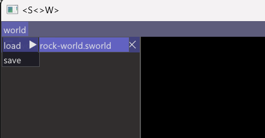

## 简介
用于实践一些技术以及用于测试一些shader和pipeline。

## 开发日志


## Build
使用cmake完成项目构建

```cmake
cmake -S . -B .\build\
```
初次构建由于需要clone和build cpython,因此需要一会时间。之后可以在.\build目录下可以看到staywalk.sln

解决方案中，需要先生成generated_code项目，自动生成ui和脚本绑定代码；然后启动engine项目即可。

启动之后，可以载入测试world.


## 问题 
构建过程中，可能会出现找不到python310_d.lib， 手动重新生成解决方案中ThridParty/cpython/pythoncode即可；因为自动构建的bat在powershell中启动存在一些问题；